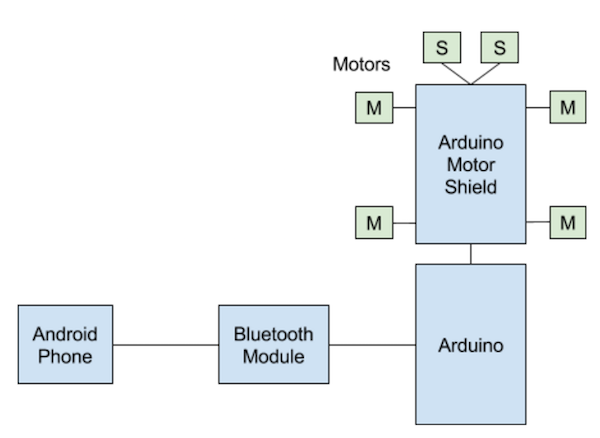
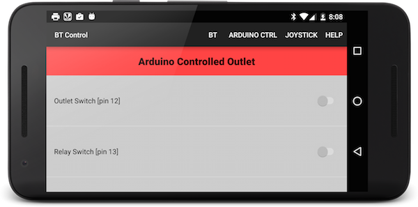
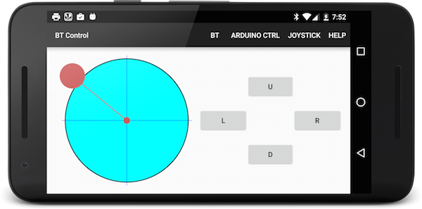

BluetoothCtrlProject
====================

Bluetooth SPP based control app

The application uses HC-06 or HC-05 BT module and communicates with Arduino.
There are two different UIs of communicating with Arduino:

* Arduino Ctrl
* Joystick



## Arduino Ctrl Mode
In Arduino Ctrl, we simply send a byte of data to Arduino. This may be a simplistic
way to send commands to Arduino.



## Joystick Mode
In second Joystick mode, the coordinates of a virtual joystick is sent to Arduino. This will
help us build an Arduino controlled robot. Just like a joystick, there are 4 buttons.
The intent of these 4 buttons is to control 2 servo motors.




## Hardware Components
This program uses

* Adafruit Motor Shield V1 https://learn.adafruit.com/adafruit-motor-shield/overview
* An HC-06 BT module. The HC-06 BT modules connects to A0 and A1 pins on Arduino UNO R3
* Arduino

## Message Protocol:
The Android device and the Arduino Robot use a 1 byte message for command and control.

```
bit 7: Joystick or Buttons 0:joystick, 1 button
if joystick:
    bit 6: 0=FORWARD, 1=BACKWARD
    bit 5-4: y coords move straight
    bit 3-2: x coords speed decreese for left wheel
    bit 1-0: x coords speed decreese for right wheel
if button:
    bit 0: U/F
    bit 1: D/B
    bit 2: L
    bit 3: R  
```